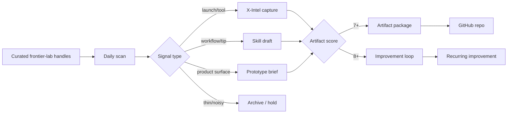

# Frontier Lab Signal Dashboard Workflow

Source package: [[../Generated-Packages/Frontier Lab Signal Dashboard/README|Frontier Lab Signal Dashboard]]

## Operating heuristic

| Signal | Route | Why |
|---|---|---|
| Model/API launch | Tool or product brief | Can change what Vinay builds next |
| Coding-agent tip | Technique or skill draft | Reusable agent procedure |
| AI Studio/Cursor workflow | Prototype | Visual/productizable workflow |
| Research detail | Idea or thread | Requires synthesis before build |
| Hype-only post | Hold/archive | Avoid noisy repo creation |

## How Vinay can use it

Start each day with one question: “Which frontier-lab post changes a product, agent, or repo I should build this week?” Anything that passes the threshold becomes an X-Intel note and, if score ≥ 7, an artifact package.
